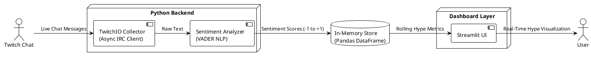

# 🔥 Twitch Hype Tracker  
**Real-Time Twitch Chat Sentiment & Hype Analytics (Local-First)**

---

## 📌 Project Overview

**Twitch Hype Tracker** is a local-first, real-time analytics system that connects to a live Twitch chat, analyzes audience sentiment, and visualizes the stream’s overall **Hype Level** over time.

Unlike traditional data analysis projects that operate on static datasets, this project focuses on **live data ingestion, streaming processing, and real-time visualization**, mirroring real-world systems used in social media analytics and live monitoring platforms.

---

## 🎯 Project Goals

This project is designed to demonstrate the following engineering competencies:

- Real-time data ingestion from a live messaging platform
- Asynchronous and event-driven system design
- Natural Language Processing (NLP) for short-form social text
- Rolling-window aggregation on streaming data
- Clean system architecture and documentation
- Professional GitHub workflow with pull requests

---

## 🧠 System Architecture (Level 0 – Data Flow Diagram)

The system follows a **producer → processor → storage → visualization** pipeline.

# 🏗 System Design Principles

Local-First

Asynchronous Processing

Loose Coupling

Rolling Window Analytics

# 🛠 Planned Tech Stack

The table with:

Python

TwitchIO

VADER

Pandas

Streamlit

Git & GitHub

# 📐 Hype Level Definition

Explanation of:

Rolling average

Positive / Negative / Neutral impact

# 🗺 Implementation Roadmap

Phases 1–4 table

# 🤝 Development Workflow

main

feature/*

Pull Request rules

# 🔐 Security & Configuration

.env

.gitignore

No secrets committed

# 🚀 Planned Enhancements (Future Work)

Emote analysis

Message volume

Redis / Docker

# 📚 Disclaimer

Educational / not affiliated with Twitch
